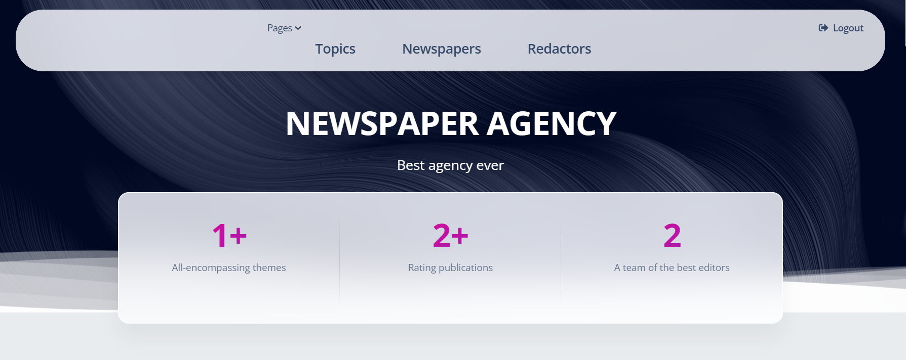

# Agency Project

This project was created for managing newspapers and redactors in Agency

## Check it out!

[Agency Project deploved to Render](https://agency-system.onrender.com/)

## Technology stack

* Backend: Python 3, Django, SQLite
* Frontend: HTML/CSS
* Deployment: Render
* Dependency Management: pip
* Virtual Environment: venv
* Version Control: Git
* Database Migrations: Django Migrations
* Environment Variables: .env
* Authentication: Django Authentication
* Testing: Unittest
* Other: requirements.txt

## Installation

Python3 must be already installed

```shell
# Clone the repository:
git clone https://github.com/oleg-potichnyi/newspaper-agency.git
# Change directory to the project folder:
cd newspapers
# Set up a virtual environment:
python3 -m venv venv
# Activate the virtual environment on Windows:
venv\Scripts\activate
# On macOS/Linux:
source venv/bin/activate
# Install dependencies:
pip install -r requirements.txt
# Environment variables:
## To use the .env and .env.sample files, simply duplicate the .env.sample file and rename it as .env.
## Fill in the variables in the .env file with your actual configuration values, 
## keeping sensitive information private, while the .env.sample file acts as a reference
## for other developers to understand the required environment variables.
# Run this command to apply migrations and update the database schema:
python manage.py migrate
# Start the development server:
python manage.py runserver
```

## Features

* Authentication functionality for Redactor/User
* Managing newspapers redactors and topics of publications directly from website interface
* Powerful admin panel for advanced management

## Demo



## User render credentials

```shell
login: user
password: user12345
```

## User local credentials

```shell
login: admin_user
password: 1qazcde3
```
